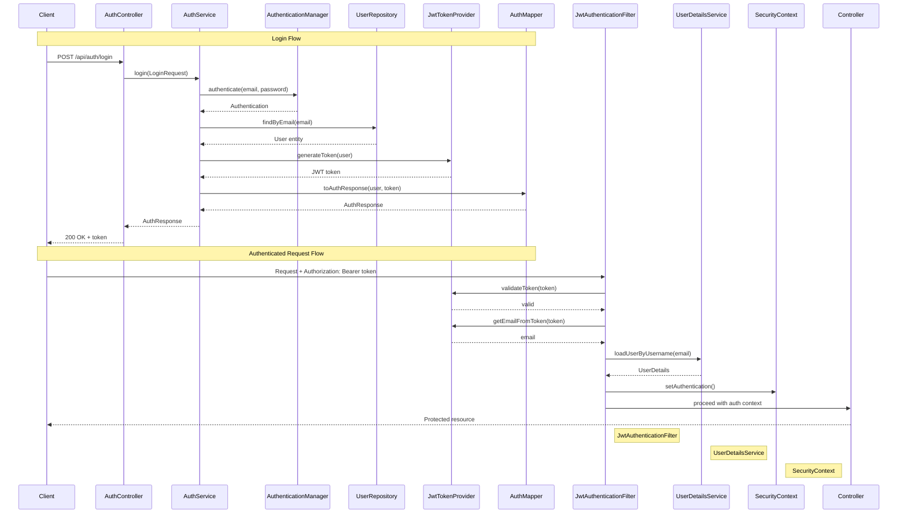

# Authentication Feature

## Overview

JWT-based stateless authentication with Spring Security supporting role-based access (EMPLOYEE, MANAGER) and manager hierarchy. Users authenticate once and receive a token valid for 24 hours.

## Architecture Flow



## Design Decisions

### Why Custom JWT Implementation?
  Simplicity: This is a profile management app with straightforward authentication needs (login, role-based access). Full-featured IAM platforms add unnecessary complexity and infrastructure overhead.

**Stateless JWT vs Session-Based**:
- Stateless enables horizontal scaling without session replication
- No server-side session storage reduces memory footprint
- Trade-off: Cannot invalidate tokens before expiration (mitigated with short expiration + refresh tokens)

**BCrypt for Passwords**:
- Industry-standard adaptive hashing (resistant to brute force as hardware improves)
- 10 rounds balances security vs performance

**MVC Architecture**:
- Clear separation of concerns (controller → service → repository)
- Easier to test, maintain, and extend
- Interface-based services (`AuthService`) for encapsulation

**Manager Hierarchy in Database**:
- Self-referencing foreign key supports organizational structure
- Enables future features: approval workflows, reporting chains, delegate access

## Database

**users table**: Stores user credentials (BCrypt hashed), roles, and manager relationships via self-referencing `manager_id` foreign key.

**Demo users** (password: `pwd951753`):
- `manager@company.com` - MANAGER with no manager
- `emp1@company.com`, `emp2@company.com` - EMPLOYEEs reporting to manager

**Migrations**:
- V1 (UUID extension)
- V2 (users table + indexes)
- V3 (demo data - idempotent with `INSERT...WHERE NOT EXISTS`)

**Flyway Strategy**:
- `validate-on-migrate: true` - Validates checksums without re-running
- `baseline-on-migrate: true` - Handles existing databases gracefully
- `out-of-order: true` - Allows development flexibility
- `clean-disabled: true` - Safety guard against accidental data loss
- Migrations are idempotent (can be run multiple times safely)

## Components Overview

### Security Chain
1. **JwtTokenProvider**: Generates/validates JWT tokens with claims (userId, email, employeeId, role, managerId). Configurable via `jwt.secret` and `jwt.expiration`.
2. **JwtAuthenticationFilter**: Intercepts requests, extracts JWT from `Authorization: Bearer` header, validates, and sets Spring Security context.
3. **SecurityConfig**: Configures stateless sessions, CORS (localhost:5173), public endpoints (`/api/auth/**`), and BCrypt password encoding.
4. **UserDetailsServiceImpl**: Loads users by email for Spring Security, assigns `ROLE_<role>` authorities.

### Business Logic
5. **AuthService/Impl**: Handles `login()` (validates credentials, generates token) and `switchUser()` (demo feature for testing different roles without password).
6. **AuthController**: Exposes REST endpoints with OpenAPI annotations.
7. **AuthMapper**: Converts User entity + token → AuthResponse DTO.

### Data Layer
8. **User entity**: JPA entity with auditing (`@EntityListeners`), lazy-loaded manager relationship.
9. **UserRepository**: JPA repository with `findByEmail()` and `findByEmployeeId()` queries.

### DTOs
- **LoginRequest**: email (validated), password
- **SwitchUserRequest**: email (validated)
- **AuthResponse**: token, userId, email, employeeId, role, managerId

## API Endpoints

### POST /api/auth/login
Authenticate with email/password, returns JWT token and user details.
- **200**: Success with AuthResponse
- **400**: Validation error
- **401**: Invalid credentials

### POST /api/auth/switch-user
Demo endpoint to switch users without password (for testing roles).
- **200**: Success with new token
- **400**: Validation error
- **404**: User not found

### Authenticated Requests
Include header: `Authorization: Bearer <token>`

## JWT Token Structure

**Claims**: subject (userId), email, employeeId, role, managerId, iat (issued at), exp (expiration)
**Format**: header.payload.signature (HMAC SHA-256)
**Expiration**: Default 24 hours (configurable)

## Configuration

**application.yml**:
```yaml
jwt:
  secret: ${JWT_SECRET:default-secret-min-256-bits}
  expiration: ${JWT_EXPIRATION:86400000}  # milliseconds
```

**Dependencies**: jjwt (0.12.3), spring-security, springdoc-openapi (2.3.0), validation

**CORS**: Allows `http://localhost:5173` with credentials, all methods/headers

## Testing

**Swagger UI**: `http://localhost:8080/swagger-ui.html`

**cURL login**:
```bash
curl -X POST http://localhost:8080/api/auth/login \
  -H "Content-Type: application/json" \
  -d '{"email":"manager@company.com","password":"password123"}'
```

**cURL authenticated request**:
```bash
curl http://localhost:8080/api/employees/profile \
  -H "Authorization: Bearer <token>"
```

## Extension Points

### Adding Roles
1. Update `Role` enum
2. Modify database constraint on users.role
3. Seed new users

### Role-Based Authorization
Use `@PreAuthorize("hasRole('MANAGER')")` on controller methods (requires `@EnableMethodSecurity`).

### Refresh Tokens
Create `RefreshToken` entity with longer expiration, add `/api/auth/refresh` endpoint to exchange refresh token for new access token.

### Password Reset
Create `PasswordResetToken` entity, add email service, implement `/api/auth/forgot-password` and `/api/auth/reset-password` endpoints.

### 2FA
Add `twoFactorEnabled` and `twoFactorSecret` to User entity, integrate TOTP library (e.g., googleauth), add verification step in login.

### OAuth2
Configure Spring Security OAuth2 with social login providers (Google, GitHub) via `oauth2Login()` configuration.

### Migration to Keycloak (if needed)
1. Deploy Keycloak server, create realm
2. Replace `JwtTokenProvider` with Keycloak token validation
3. Update `SecurityConfig` to use Keycloak adapter
4. Migrate users or configure user federation
5. Update frontend to use Keycloak JS adapter

## File Locations

```
backend/src/main/java/com/newwork/employee/
├── config/SecurityConfig.java
├── controller/AuthController.java
├── dto/{request/LoginRequest, request/SwitchUserRequest, response/AuthResponse}.java
├── entity/{User, enums/Role}.java
├── mapper/AuthMapper.java
├── repository/UserRepository.java
├── security/{JwtTokenProvider, JwtAuthenticationFilter}.java
└── service/{AuthService, AuthServiceImpl, UserDetailsServiceImpl}.java

backend/src/main/resources/
├── application.yml
└── db/migration/{V1__enable_uuid, V2__create_users, V3__seed_demo}.sql
```

## Security Considerations

- **JWT Secret**: Must be at least 256 bits for HMAC SHA-256. Use environment variable `JWT_SECRET` in production.
- **Token Storage (Client)**: Store JWT in memory or sessionStorage (better security). Avoid localStorage if XSS risk is high.
- **HTTPS**: Always use HTTPS in production to prevent token interception.
- **Token Expiration**: 24-hour expiration balances security and UX. Consider shorter expiration + refresh tokens for sensitive apps.

## Exception Handling

Custom exceptions with global handler (`@RestControllerAdvice`):
- `InvalidCredentialsException` (401) - Wrong email/password
- `UserNotFoundException` (404) - User doesn't exist
- `GlobalExceptionHandler` - Maps exceptions to HTTP responses with consistent `ApiError` format

## Testing

### Test Coverage

**Unit Tests** (17 tests - `JwtTokenProviderTest`):
- Token generation and validation
- Claim extraction (userId, email)
- Expiration handling
- Invalid/malformed token handling
- Edge cases (null, empty, different secrets)

**Unit Tests** (8 tests - `AuthServiceTest`):
- Login with valid/invalid credentials
- User switching functionality
- Service layer business logic
- Mockito for dependency isolation

**Integration Tests** (14 tests - `AuthControllerIntegrationTest`):
- Full authentication flow with real database
- Uses Testcontainers (PostgreSQL 16-alpine)
- Login endpoint validation
- Switch user endpoint validation
- Error responses (400, 401, 404)
- Separate test data from demo data

### Running Tests

```bash
# Run all tests
mvn test

# Run specific test class
mvn test -Dtest=JwtTokenProviderTest

# Run with coverage
mvn test jacoco:report
```

### Test Data Strategy

- **Production demo data**: `manager@company.com`, `emp1@company.com`, `emp2@company.com`
- **Test data**: `test.manager@testcompany.com`, `test.employee1@testcompany.com`, etc.
- Tests use `@BeforeEach` to seed fresh data
- Testcontainers provide isolated PostgreSQL instance per test class

## Troubleshooting

- **Invalid JWT**: Check token expiration, verify `JWT_SECRET` consistency across environments
- **CORS errors**: Ensure frontend URL in `corsConfigurationSource()` matches actual origin
- **Access Denied**: Verify role authorities use `ROLE_` prefix, check `@PreAuthorize` expressions
- **401 on login**: Confirm password matches BCrypt hash, check user exists in database
- **Connection refused**: Start PostgreSQL via `docker-compose up -d` before running application
