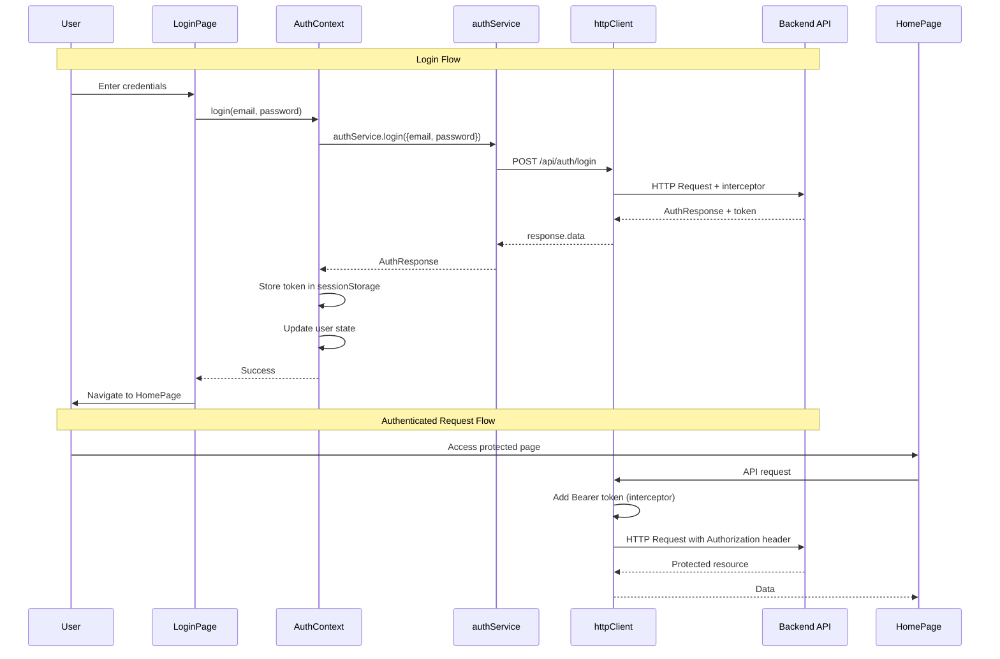

# Frontend Authentication

## Overview

React-based authentication UI with JWT token management, protected routes, and role switching. Built with TypeScript, React Router, and Axios.

## Architecture



## Design Decisions

**sessionStorage vs localStorage**:
- Uses sessionStorage for JWT tokens (cleared on browser close)
- More secure than localStorage (reduces XSS attack surface)
- Trade-off: User must re-login after closing browser (acceptable for demo)

**Context API vs State Management Library**:
- Uses React Context for auth state (lightweight, built-in)
- Sufficient for auth state (user, token, isAuthenticated)
- Avoid Redux overhead for simple auth needs

**Axios Interceptors**:
- Centralized token attachment to all requests
- Automatic 401 handling (logout on token expiration)
- Reduces boilerplate in individual API calls

**Feature-Based Structure**:
- Code organized by feature (`features/auth/*`) not by file type
- Each feature contains components, pages, contexts, API services
- Improves maintainability and scalability

## Directory Structure

```
frontend/src/
├── features/auth/
│   ├── api/auth-service.ts          # API calls to backend
│   ├── components/
│   │   ├── ProtectedRoute.tsx       # Route wrapper for auth check
│   │   ├── SwitchUserDialog.tsx     # Modal for role switching
│   │   └── SwitchUserDialog.css
│   ├── contexts/AuthContext.tsx     # Auth state management
│   ├── pages/
│   │   ├── LoginPage.tsx            # Login form
│   │   └── LoginPage.css
│   └── types.ts                     # TypeScript interfaces
├── lib/http-client.ts               # Axios instance with interceptors
├── pages/
│   ├── HomePage.tsx                 # Protected home page
│   └── HomePage.css
└── App.tsx                          # Router setup
```

## Components

### AuthContext & useAuth Hook

**Location**: [features/auth/contexts/AuthContext.tsx](../../frontend/src/features/auth/contexts/AuthContext.tsx)

Provides global auth state and methods to all components.

**State**:
- `user`: Current user object (User | null)
- `token`: JWT token (string | null)
- `isAuthenticated`: Boolean derived from user && token
- `isLoading`: Loading state during initial auth check

**Methods**:
- `login(email, password)`: Authenticates user, stores token
- `switchUser(email)`: Switches to different user (demo feature)
- `logout()`: Clears auth state and sessionStorage

**Usage**:
```typescript
import { useAuth } from './features/auth/contexts/AuthContext';

function MyComponent() {
  const { user, isAuthenticated, login, logout } = useAuth();

  // Access user data
  console.log(user?.role); // "EMPLOYEE" | "MANAGER"
}
```

### LoginPage

**Location**: [features/auth/pages/LoginPage.tsx](../../frontend/src/features/auth/pages/LoginPage.tsx)

Email/password login form with validation and demo account information.

**Features**:
- Client-side email format validation
- Password required validation
- Loading state during submission
- Error display for 401/network errors
- Demo account emails shown for convenience

**Form Validation**:
- Email: Required, valid email format
- Password: Required
- Shows inline errors before submission

### ProtectedRoute

**Location**: [features/auth/components/ProtectedRoute.tsx](../../frontend/src/features/auth/components/ProtectedRoute.tsx)

Wrapper component that guards routes requiring authentication.

**Logic**:
1. Check `isAuthenticated` from AuthContext
2. If loading, show loading spinner
3. If not authenticated, redirect to `/login`
4. If authenticated, render children

**Usage**:
```typescript
<Route
  path="/profile"
  element={
    <ProtectedRoute>
      <ProfilePage />
    </ProtectedRoute>
  }
/>
```

### SwitchUserDialog

**Location**: [features/auth/components/SwitchUserDialog.tsx](../../frontend/src/features/auth/components/SwitchUserDialog.tsx)

Modal dialog for switching between user accounts (demo feature).

**Features**:
- Email input with validation
- Quick switch buttons (Manager, Employee 1, Employee 2)
- Error handling for 404/network errors
- Closes on successful switch

**Props**:
- `isOpen`: boolean - Controls dialog visibility
- `onClose`: () => void - Callback when dialog closes

## HTTP Client

**Location**: [lib/http-client.ts](../../frontend/src/lib/http-client.ts)

Axios instance configured for the backend API.

**Configuration**:
- Base URL: `http://localhost:8080` (from `VITE_API_BASE_URL`)
- Content-Type: `application/json`

**Request Interceptor**:
- Reads token from sessionStorage
- Attaches `Authorization: Bearer <token>` header to every request

**Response Interceptor**:
- Catches 401 errors (token expired/invalid)
- Clears auth state (token, user)
- Redirects to `/login`

## Authentication Service

**Location**: [features/auth/api/auth-service.ts](../../frontend/src/features/auth/api/auth-service.ts)

API service for authentication endpoints.

**Methods**:

```typescript
authService.login(credentials: LoginRequest): Promise<AuthResponse>
// POST /api/auth/login
// Returns: { token, userId, email, employeeId, role, managerId }

authService.switchUser(request: SwitchUserRequest): Promise<AuthResponse>
// POST /api/auth/switch-user
// Returns: same as login
```

## TypeScript Types

**Location**: [features/auth/types.ts](../../frontend/src/features/auth/types.ts)

```typescript
interface User {
  userId: string;
  email: string;
  employeeId: string;
  role: 'EMPLOYEE' | 'MANAGER';
  managerId: string | null;
}

interface AuthResponse {
  token: string;
  userId: string;
  email: string;
  employeeId: string;
  role: string;
  managerId: string | null;
}

interface AuthContextType {
  user: User | null;
  token: string | null;
  isAuthenticated: boolean;
  isLoading: boolean;
  login: (email: string, password: string) => Promise<void>;
  switchUser: (email: string) => Promise<void>;
  logout: () => void;
}
```

## Routing

**Location**: [App.tsx](../../frontend/src/App.tsx)

React Router configuration with public and protected routes.

**Routes**:
- `/login` - Public (LoginPage)
- `/` - Protected (HomePage, requires auth)
- `*` - Catch-all (redirects to `/`)

**Structure**:
```typescript
<BrowserRouter>
  <AuthProvider>
    <Routes>
      <Route path="/login" element={<LoginPage />} />
      <Route path="/" element={
        <ProtectedRoute><HomePage /></ProtectedRoute>
      } />
    </Routes>
  </AuthProvider>
</BrowserRouter>
```

## Environment Variables

**Location**: [.env](../../frontend/.env)

```
VITE_API_BASE_URL=http://localhost:8080
```

Access in code: `import.meta.env.VITE_API_BASE_URL`

## Running the Frontend

```bash
cd frontend
npm install
npm run dev
```

Application starts at `http://localhost:5173`

## Testing Authentication

1. **Login as Manager**:
   - Email: `manager@company.com`
   - Password: `password123`
   - Role badge shows "MANAGER"

2. **Login as Employee**:
   - Email: `emp1@company.com`
   - Password: `password123`
   - Role badge shows "EMPLOYEE"
   - Manager ID displayed

3. **Switch User**:
   - Click "Switch User" button in header
   - Select quick switch or enter email
   - Immediately switches without re-authentication

4. **Protected Route**:
   - Try accessing `http://localhost:5173/` without logging in
   - Should redirect to `/login`

5. **Token Expiration**:
   - Wait 24 hours or manually delete sessionStorage token
   - Next API request triggers 401 → auto-logout

## Error Handling

**Login Errors**:
- 401: "Invalid email or password"
- Network error: "An error occurred. Please try again."
- Validation error: Shown before submission

**Switch User Errors**:
- 404: "User not found with this email"
- Network error: "An error occurred. Please try again."

**Token Expiration**:
- Automatic logout on 401 response
- Redirect to login page
- User must re-authenticate

## Extension Points

### Adding Remember Me

1. Add checkbox to LoginPage
2. Store token in localStorage if checked
3. Update httpClient to check both storages

### Adding Password Reset

1. Create ForgotPasswordPage component
2. Add authService.forgotPassword() method
3. Create ResetPasswordPage with token validation

### Adding Token Refresh

1. Add refreshToken to AuthResponse
2. Create authService.refreshToken() method
3. Update response interceptor to attempt refresh before logout
4. Store refresh token separately

### Adding Loading Skeleton

Replace loading spinner in ProtectedRoute with skeleton UI:
```typescript
if (isLoading) {
  return <PageSkeleton />;
}
```

### Adding Form Library

Integrate React Hook Form for advanced validation:
```bash
npm install react-hook-form
```

### Adding Toast Notifications

Add react-toastify for user feedback:
```bash
npm install react-toastify
```

## Security Best Practices

- ✅ HTTPS in production (prevents token interception)
- ✅ sessionStorage (cleared on browser close)
- ✅ Automatic logout on 401 (handles token expiration)
- ✅ Password input type (hides characters)
- ✅ autoComplete attributes (browser password manager)
- ⚠️ Consider httpOnly cookies for production (immune to XSS)
- ⚠️ Implement CSRF protection if using cookies
- ⚠️ Add rate limiting on backend login endpoint

## Troubleshooting

- **CORS Error**: Ensure backend SecurityConfig allows `http://localhost:5173`
- **401 on All Requests**: Check JWT_SECRET matches between frontend storage and backend
- **Redirect Loop**: Verify ProtectedRoute logic and auth state initialization
- **Token Not Attached**: Check httpClient interceptor and sessionStorage key names
- **TypeScript Errors**: Ensure types.ts interfaces match backend AuthResponse structure
