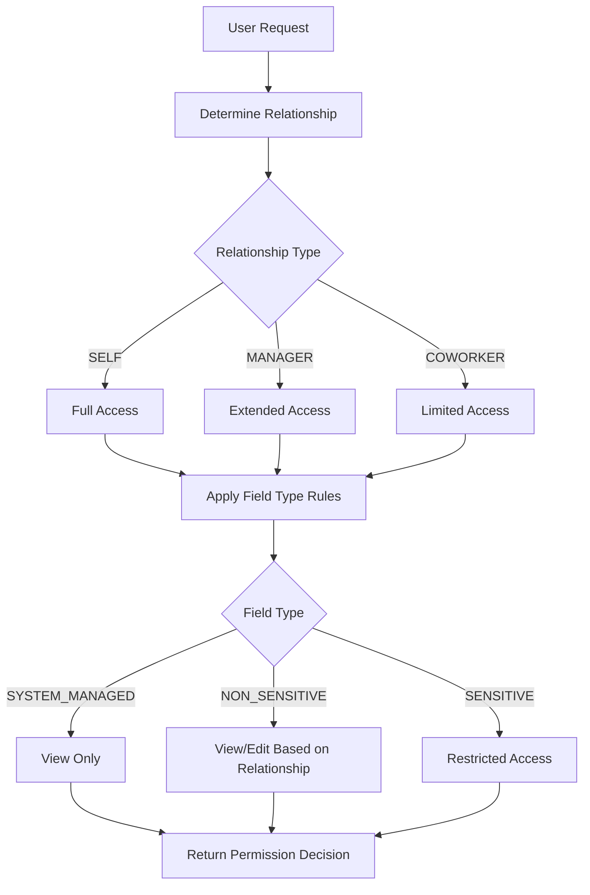

# Permission System

## Overview

The Permission System controls field visibility and edit rights based on the relationship between the viewer and the profile owner. It implements a role-based access control (RBAC) model that ensures employees can only view and modify data they're authorized to access, as defined in PRD Section 3.3.

## Purpose

The permission system serves three critical functions:

1. **Data Privacy** - Protect sensitive employee information from unauthorized access
2. **Compliance** - Enforce organizational policies for data visibility and modification
3. **User Experience** - Provide appropriate access based on relationship context (viewing own profile vs. team member vs. manager oversight)

## Architecture

### Components

The permission system consists of three main components:

1. **Field Classification** ([FieldType](backend/src/main/java/com/newwork/employee/entity/enums/FieldType.java)) - Categorizes profile data
2. **Relationship Detection** ([Relationship](backend/src/main/java/com/newwork/employee/entity/enums/Relationship.java)) - Determines viewer's relationship to profile owner
3. **Permission Evaluation** ([PermissionService](backend/src/main/java/com/newwork/employee/service/PermissionService.java)) - Applies access rules



## Field Classifications

Profile data is categorized into three types based on sensitivity and control requirements:

### 1. SYSTEM_MANAGED

HR/IT-controlled data that is **always read-only** in the application.

**Fields**:
- Employee ID (immutable)
- Legal first/last name (HR process)
- Work email (HR process)
- Manager ID (HR process)
- Department / Org unit (HR process)
- Job code / Job family (HR process)
- Job level / Grade (HR process)
- Employment status (HR process)
- Hire date (immutable)
- Termination date (immutable)
- Work schedule / FTE (HR process)

**Visibility**: Everyone
**Edit Rights**: None (HR/IT systems only, out of scope)

### 2. NON_SENSITIVE

Information intended for internal collaboration and visibility.

**Fields**:
- Preferred/display name
- Job title
- Office location
- Work phone
- Work location type (remote/hybrid/onsite)
- Bio / About
- Skills
- Profile photo

**Visibility**: Everyone
**Edit Rights**: Employee (self) + Manager (for direct reports)

### 3. SENSITIVE

Private or regulated information with restricted visibility.

**Fields**:
- Personal email
- Personal phone
- Home address
- Emergency contacts
- Date of birth
- Visa / work permit
- Absence balance
- Salary & compensation
- Performance rating

**Visibility**: Employee (self) + Manager (for direct reports)
**Edit Rights**: Employee (self) only

## Relationship Types

The system detects three relationship types between the viewer and the profile owner:

### SELF

The viewer is viewing their own profile.

**Detection**: `viewerId == profileOwnerId`

**Access Level**: Full access
- View all fields (SYSTEM_MANAGED, NON_SENSITIVE, SENSITIVE)
- Edit personal fields (NON_SENSITIVE, SENSITIVE)
- Cannot edit SYSTEM_MANAGED fields

### MANAGER

The viewer is the direct manager of the profile owner.

**Detection**: `profileOwner.managerId == viewerId`

**Access Level**: Extended access
- View all fields (SYSTEM_MANAGED, NON_SENSITIVE, SENSITIVE)
- Edit NON_SENSITIVE fields only
- Cannot edit SENSITIVE or SYSTEM_MANAGED fields

**Important**: Only **direct** manager relationships are recognized. Indirect managers (manager's manager) are treated as COWORKER.

### COWORKER

The viewer is neither the profile owner nor their manager.

**Detection**: Default when not SELF or MANAGER

**Access Level**: Limited access
- View public fields only (SYSTEM_MANAGED, NON_SENSITIVE)
- Cannot view SENSITIVE fields
- Cannot edit any fields

## Permission Matrix

Complete permission matrix as defined in PRD Section 3.3:

| Action / Field Type          | SELF (Owner) | MANAGER (Direct) | COWORKER |
|------------------------------|--------------|------------------|----------|
| **View – SYSTEM_MANAGED**    | ✅           | ✅               | ✅       |
| **Edit – SYSTEM_MANAGED**    | ❌           | ❌               | ❌       |
| **View – NON_SENSITIVE**     | ✅           | ✅               | ✅       |
| **Edit – NON_SENSITIVE**     | ✅           | ✅               | ❌       |
| **View – SENSITIVE**         | ✅           | ✅               | ❌       |
| **Edit – SENSITIVE**         | ✅           | ❌               | ❌       |

### Key Rules

1. **System-managed fields**: No one can edit (HR/IT only)
2. **Non-sensitive fields**: SELF and MANAGER can edit
3. **Sensitive fields**: Only SELF can edit, MANAGER can view
4. **Public visibility**: SYSTEM_MANAGED and NON_SENSITIVE visible to everyone
5. **Private data**: SENSITIVE fields hidden from COWORKER

## Implementation

### Service Interface

[PermissionService.java](backend/src/main/java/com/newwork/employee/service/PermissionService.java)

```java
public interface PermissionService {
    // Relationship detection
    Relationship determineRelationship(UUID viewerId, UUID profileOwnerId);
    Relationship determineRelationship(User viewer, User profileOwner);

    // Permission evaluation
    boolean canView(Relationship relationship, FieldType fieldType);
    boolean canEdit(Relationship relationship, FieldType fieldType);

    // Convenience methods
    boolean canView(UUID viewerId, UUID profileOwnerId, FieldType fieldType);
    boolean canEdit(UUID viewerId, UUID profileOwnerId, FieldType fieldType);
}
```

### Service Implementation

[PermissionServiceImpl.java](backend/src/main/java/com/newwork/employee/service/impl/PermissionServiceImpl.java)

**Key Methods**:

#### 1. Relationship Detection

```java
public Relationship determineRelationship(UUID viewerId, UUID profileOwnerId) {
    // Check SELF
    if (viewerId.equals(profileOwnerId)) {
        return Relationship.SELF;
    }

    // Load profile owner
    User profileOwner = userRepository.findById(profileOwnerId)
        .orElseThrow(() -> new UserNotFoundException(...));

    // Check MANAGER
    if (profileOwner.getManager() != null &&
        profileOwner.getManager().getId().equals(viewerId)) {
        return Relationship.MANAGER;
    }

    // Default to COWORKER
    return Relationship.COWORKER;
}
```

#### 2. View Permission Evaluation

```java
public boolean canView(Relationship relationship, FieldType fieldType) {
    return switch (fieldType) {
        case SYSTEM_MANAGED -> true;  // Everyone
        case NON_SENSITIVE -> true;   // Everyone
        case SENSITIVE -> relationship == SELF || relationship == MANAGER;
    };
}
```

#### 3. Edit Permission Evaluation

```java
public boolean canEdit(Relationship relationship, FieldType fieldType) {
    return switch (fieldType) {
        case SYSTEM_MANAGED -> false;  // No one
        case NON_SENSITIVE -> relationship == SELF || relationship == MANAGER;
        case SENSITIVE -> relationship == SELF;
    };
}
```

## Usage Examples

### Example 1: Employee Viewing Own Profile

```java
UUID employeeId = UUID.fromString("...");

// Determine relationship
Relationship rel = permissionService.determineRelationship(employeeId, employeeId);
// Result: SELF

// Check permissions
boolean canViewSensitive = permissionService.canView(rel, FieldType.SENSITIVE);
// Result: true

boolean canEditSensitive = permissionService.canEdit(rel, FieldType.SENSITIVE);
// Result: true
```

### Example 2: Manager Viewing Direct Report

```java
UUID managerId = UUID.fromString("...");
UUID employeeId = UUID.fromString("...");

// Determine relationship
Relationship rel = permissionService.determineRelationship(managerId, employeeId);
// Result: MANAGER

// Check permissions
boolean canViewSensitive = permissionService.canView(rel, FieldType.SENSITIVE);
// Result: true (manager can view sensitive fields)

boolean canEditSensitive = permissionService.canEdit(rel, FieldType.SENSITIVE);
// Result: false (manager cannot edit sensitive fields)

boolean canEditNonSensitive = permissionService.canEdit(rel, FieldType.NON_SENSITIVE);
// Result: true (manager can edit non-sensitive fields)
```

### Example 3: Coworker Viewing Peer Profile

```java
UUID coworkerId = UUID.fromString("...");
UUID employeeId = UUID.fromString("...");

// Determine relationship
Relationship rel = permissionService.determineRelationship(coworkerId, employeeId);
// Result: COWORKER

// Check permissions
boolean canViewSensitive = permissionService.canView(rel, FieldType.SENSITIVE);
// Result: false (coworker cannot view sensitive fields)

boolean canViewNonSensitive = permissionService.canView(rel, FieldType.NON_SENSITIVE);
// Result: true (coworker can view non-sensitive fields)

boolean canEdit = permissionService.canEdit(rel, FieldType.NON_SENSITIVE);
// Result: false (coworker cannot edit any fields)
```

### Example 4: Using Convenience Methods

```java
// Direct permission check without separate relationship detection
boolean canEdit = permissionService.canEdit(
    viewerId,
    profileOwnerId,
    FieldType.NON_SENSITIVE
);
```

## Integration with Profile API

The permission service will be integrated into profile endpoints to:

1. **Filter visible fields** - Remove sensitive fields from response when viewer is COWORKER
2. **Validate edit requests** - Reject attempts to modify fields without permission
3. **Enforce business rules** - Ensure managers can only edit direct reports

**Example Profile Endpoint Integration**:

```java
@GetMapping("/api/profiles/{id}")
public ResponseEntity<ProfileResponse> getProfile(
    @PathVariable UUID id,
    @AuthenticationPrincipal UserDetails userDetails
) {
    UUID viewerId = getCurrentUserId(userDetails);

    // Determine relationship
    Relationship relationship = permissionService.determineRelationship(viewerId, id);

    // Fetch profile
    Profile profile = profileService.getProfile(id);

    // Filter fields based on permissions
    ProfileResponse response = filterByPermissions(profile, relationship);

    return ResponseEntity.ok(response);
}
```

## Testing

### Unit Tests

[PermissionServiceTest.java](backend/src/test/java/com/newwork/employee/service/PermissionServiceTest.java)

**Test Coverage**: 20 tests organized into 4 categories

1. **Relationship Detection Tests** (6 tests)
   - SELF relationship detection
   - MANAGER relationship detection
   - COWORKER relationship detection
   - Edge cases (no manager, unknown user)

2. **View Permission Tests** (6 tests)
   - SELF can view all fields
   - MANAGER can view all fields
   - COWORKER limited view access
   - UUID-based convenience methods

3. **Edit Permission Tests** (7 tests)
   - No one can edit SYSTEM_MANAGED
   - SELF edit permissions
   - MANAGER edit permissions
   - COWORKER cannot edit
   - UUID-based convenience methods

4. **Permission Matrix Verification** (1 comprehensive test)
   - Verifies complete matrix matches PRD

**Running Tests**:

```bash
cd backend
mvn test -Dtest=PermissionServiceTest
```

**Test Results**:
```
Tests run: 20, Failures: 0, Errors: 0, Skipped: 0
```

### Test Examples

```java
@Test
@DisplayName("Manager can view sensitive fields but cannot edit them")
void managerPermissionsForSensitiveFields() {
    // MANAGER can view sensitive
    assertThat(permissionService.canView(Relationship.MANAGER, FieldType.SENSITIVE))
        .isTrue();

    // But MANAGER cannot edit sensitive
    assertThat(permissionService.canEdit(Relationship.MANAGER, FieldType.SENSITIVE))
        .isFalse();
}
```

## Security Considerations

### Direct Manager Only

The system recognizes **only direct manager** relationships. Indirect managers (manager's manager, skip-level) are treated as COWORKER.

**Rationale**:
- Limits data exposure to immediate supervisors
- Prevents unauthorized access from senior leadership without direct oversight
- Aligns with organizational privacy policies

### Manager Hierarchy Verification

Manager relationships are verified through the database on every permission check:

```java
if (profileOwner.getManager() != null &&
    profileOwner.getManager().getId().equals(viewerId)) {
    return Relationship.MANAGER;
}
```

This ensures:
- Real-time manager relationship verification
- Protection against stale data
- Accurate permission enforcement after org changes

### Transactional Consistency

Permission checks use `@Transactional(readOnly = true)` to ensure:
- Consistent view of data during permission evaluation
- Protection against race conditions
- Repeatable reads within the same transaction

## Design Decisions

### Why Three Field Types?

The three-tier classification (SYSTEM_MANAGED, NON_SENSITIVE, SENSITIVE) balances:

1. **Simplicity** - Easy to understand and apply
2. **Flexibility** - Covers common enterprise scenarios
3. **Compliance** - Aligns with data protection regulations (GDPR, privacy laws)
4. **Extensibility** - Can add more types if needed without refactoring logic

### Why Relationship-Based vs. Role-Based?

**Relationship-based** (SELF, MANAGER, COWORKER) instead of pure role-based (EMPLOYEE, MANAGER):

**Advantages**:
- Context-aware permissions (manager of this specific employee)
- Prevents managers from accessing all employee data
- More granular control
- Better privacy protection

**Trade-offs**:
- Slightly more complex relationship detection
- Requires database lookup for manager verification

### Why Enum Pattern Matching?

Using Java switch expressions with enums provides:
- **Type safety** - Compile-time validation of all cases
- **Exhaustiveness checking** - Compiler ensures all enum values handled
- **Readability** - Clear, declarative permission rules
- **Maintainability** - Easy to modify permission matrix

## Future Enhancements

### Potential Extensions

1. **Role Hierarchy**
   - Support for indirect manager relationships (skip-level)
   - HR admin role with elevated permissions
   - Department-wide visibility for certain roles

2. **Dynamic Field Classification**
   - Allow organizations to customize field types
   - Support for industry-specific compliance requirements

3. **Audit Logging**
   - Track permission denials
   - Log sensitive data access
   - Compliance reporting

4. **Field-Level Permissions**
   - Individual field overrides
   - Temporary elevated access
   - Delegation capabilities

5. **Performance Optimization**
   - Cache relationship determinations
   - Bulk permission checks
   - Precomputed permission matrices

## Troubleshooting

### Common Issues

**Issue**: Manager cannot edit employee profile
**Solution**: Verify:
1. Manager relationship is set correctly in database
2. Editing NON_SENSITIVE fields (not SENSITIVE or SYSTEM_MANAGED)
3. Manager is the **direct** manager (not skip-level)

**Issue**: Sensitive fields visible to coworker
**Solution**: Check:
1. Relationship detection returns COWORKER
2. Frontend properly filters fields based on permissions
3. No caching of permission results with stale data

**Issue**: Permission check throws UserNotFoundException
**Solution**: Ensure:
1. Profile owner ID exists in database
2. Using valid UUID format
3. User not soft-deleted (if implementing soft delete)

## Summary

The Permission System provides a robust, flexible foundation for controlling data access in the Employee Profile application. By combining field classification with relationship-based permissions, it ensures:

- **Privacy** - Sensitive data protected from unauthorized access
- **Flexibility** - Appropriate access for different user relationships
- **Simplicity** - Clear rules easy to understand and maintain
- **Compliance** - Alignment with data protection regulations
- **Security** - Real-time verification of permissions

The system is fully tested with 20 unit tests and ready for integration into the Profile API endpoints.
