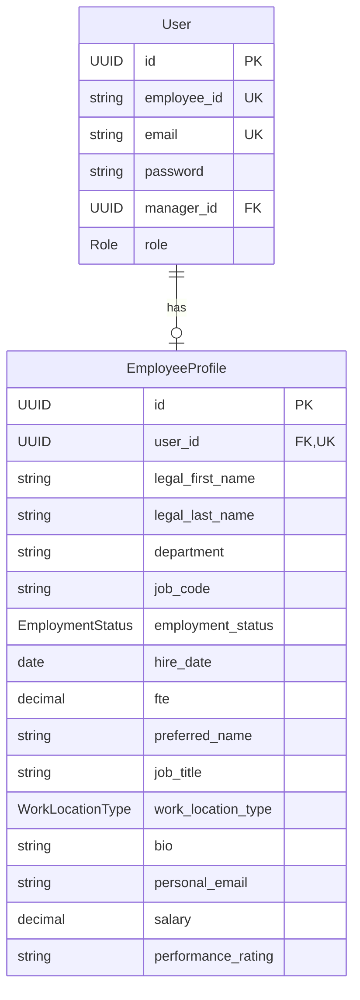

# Profile Management

## Overview

The Profile Management system stores and manages employee profile data with three-tier field classification (SYSTEM_MANAGED, NON_SENSITIVE, SENSITIVE). It integrates with the Permission System to control field visibility and edit rights based on user relationships, as defined in PRD Sections 3.2 and 3.3.

## Purpose

The profile management system provides:

1. **Comprehensive Employee Data** - Single source of truth for all employee information
2. **Field Classification** - Clear categorization of data by sensitivity and control requirements
3. **Permission Integration** - Seamless integration with the permission system for access control
4. **Data Integrity** - Database constraints and validation to ensure data quality

## Architecture

### Entity Model



### Field Classification

Employee profile fields are classified into three categories, each with different visibility and edit permissions:

#### 1. SYSTEM_MANAGED Fields

**Purpose**: HR/IT-controlled data that is always read-only in the application.

**Fields**:
- `legalFirstName` - Legal first name (process-initiated)
- `legalLastName` - Legal last name (process-initiated)
- `department` - Department/Org unit (process-initiated)
- `jobCode` - Job code (process-initiated)
- `jobFamily` - Job family (process-initiated)
- `jobLevel` - Job level/Grade (process-initiated)
- `employmentStatus` - Employment status (ACTIVE, ON_LEAVE, TERMINATED, RETIRED)
- `hireDate` - Hire date (immutable)
- `terminationDate` - Termination date (immutable)
- `fte` - Full-Time Equivalent (e.g., 1.00 = 100%, 0.50 = 50%)

**Permissions**:
- View: Everyone (SELF, MANAGER, COWORKER)
- Edit: HR/IT only (out of scope for this application)

#### 2. NON_SENSITIVE Fields

**Purpose**: Information intended for internal visibility and collaboration.

**Fields**:
- `preferredName` - Preferred/display name
- `jobTitle` - Job title
- `officeLocation` - Office location
- `workPhone` - Work phone number
- `workLocationType` - Work location type (REMOTE, HYBRID, ONSITE)
- `bio` - Biography/About section
- `skills` - Skills (stored as text, comma-separated or JSON)
- `profilePhotoUrl` - Profile photo URL

**Permissions**:
- View: Everyone (SELF, MANAGER, COWORKER)
- Edit: SELF and MANAGER (for direct reports only)

#### 3. SENSITIVE Fields

**Purpose**: Private or regulated information with restricted visibility.

**Fields**:
- `personalEmail` - Personal email address
- `personalPhone` - Personal phone number
- `homeAddress` - Home address
- `emergencyContactName` - Emergency contact name
- `emergencyContactPhone` - Emergency contact phone
- `emergencyContactRelationship` - Emergency contact relationship
- `dateOfBirth` - Date of birth
- `visaWorkPermit` - Visa/work permit information
- `absenceBalanceDays` - Absence balance (process-initiated)
- `salary` - Salary and compensation (process-initiated)
- `performanceRating` - Performance rating (process-initiated)

**Permissions**:
- View: SELF and MANAGER (for direct reports only)
- Edit: SELF only

## Database Schema

### Tables

#### employee_profiles

**Location**: [V4__create_employee_profiles_table.sql](../../backend/src/main/resources/db/migration/V4__create_employee_profiles_table.sql)

```sql
CREATE TABLE employee_profiles (
    -- Primary key
    id UUID PRIMARY KEY DEFAULT gen_random_uuid(),

    -- Foreign key to users table
    user_id UUID NOT NULL UNIQUE REFERENCES users(id) ON DELETE CASCADE,

    -- SYSTEM_MANAGED fields
    legal_first_name VARCHAR(100) NOT NULL,
    legal_last_name VARCHAR(100) NOT NULL,
    department VARCHAR(100),
    job_code VARCHAR(50),
    job_family VARCHAR(100),
    job_level VARCHAR(50),
    employment_status VARCHAR(20) NOT NULL DEFAULT 'ACTIVE',
    hire_date DATE NOT NULL,
    termination_date DATE,
    fte NUMERIC(3, 2) DEFAULT 1.00,

    -- NON_SENSITIVE fields
    preferred_name VARCHAR(100),
    job_title VARCHAR(150),
    office_location VARCHAR(200),
    work_phone VARCHAR(20),
    work_location_type VARCHAR(20),
    bio TEXT,
    skills TEXT,
    profile_photo_url VARCHAR(500),

    -- SENSITIVE fields
    personal_email VARCHAR(255),
    personal_phone VARCHAR(20),
    home_address TEXT,
    emergency_contact_name VARCHAR(200),
    emergency_contact_phone VARCHAR(20),
    emergency_contact_relationship VARCHAR(50),
    date_of_birth DATE,
    visa_work_permit VARCHAR(200),
    absence_balance_days NUMERIC(5, 2),
    salary NUMERIC(12, 2),
    performance_rating VARCHAR(50),

    -- Audit fields
    created_at TIMESTAMP NOT NULL DEFAULT CURRENT_TIMESTAMP,
    updated_at TIMESTAMP NOT NULL DEFAULT CURRENT_TIMESTAMP,

    -- Constraints
    CONSTRAINT chk_fte CHECK (fte > 0 AND fte <= 1.00),
    CONSTRAINT chk_employment_status CHECK (employment_status IN
        ('ACTIVE', 'ON_LEAVE', 'TERMINATED', 'RETIRED')),
    CONSTRAINT chk_work_location_type CHECK (work_location_type IS NULL OR
        work_location_type IN ('REMOTE', 'HYBRID', 'ONSITE'))
);
```

**Indexes**:
- `idx_employee_profiles_user_id` - Fast lookups by user ID
- `idx_employee_profiles_employment_status` - Filter active employees

**Constraints**:
- `user_id` UNIQUE - One profile per user
- `chk_fte` - FTE must be between 0 and 1.00
- `chk_employment_status` - Valid employment status values
- `chk_work_location_type` - Valid work location type values
- CASCADE DELETE - Profile deleted when user is deleted

## Implementation

### Entity

**Location**: [EmployeeProfile.java](../../backend/src/main/java/com/newwork/employee/entity/EmployeeProfile.java)

```java
@Entity
@Table(name = "employee_profiles")
public class EmployeeProfile {
    @Id
    @GeneratedValue(strategy = GenerationType.UUID)
    private UUID id;

    @OneToOne(fetch = FetchType.LAZY)
    @JoinColumn(name = "user_id", nullable = false, unique = true)
    private User user;

    // SYSTEM_MANAGED fields
    @Column(name = "legal_first_name", nullable = false, length = 100)
    private String legalFirstName;

    // NON_SENSITIVE fields
    @Column(name = "preferred_name", length = 100)
    private String preferredName;

    // SENSITIVE fields
    @Column(name = "personal_email", length = 255)
    private String personalEmail;

    // ... other fields
}
```

**Features**:
- One-to-One relationship with User entity
- JPA auditing with `@CreatedDate` and `@LastModifiedDate`
- Enum types for `EmploymentStatus` and `WorkLocationType`
- BigDecimal for monetary and fractional values
- Lazy loading for performance

### Repository

**Location**: [EmployeeProfileRepository.java](../../backend/src/main/java/com/newwork/employee/repository/EmployeeProfileRepository.java)

```java
public interface EmployeeProfileRepository extends JpaRepository<EmployeeProfile, UUID> {
    Optional<EmployeeProfile> findByUserId(UUID userId);
    List<EmployeeProfile> findByEmploymentStatus(EmploymentStatus status);
    List<EmployeeProfile> findAllActiveProfiles();
    List<EmployeeProfile> findByDepartment(String department);
    boolean existsByUserId(UUID userId);
    List<EmployeeProfile> findByManagerId(UUID managerId);
    void deleteByUserId(UUID userId);
}
```

**Query Methods**:
- `findByUserId` - Get profile for a specific user
- `findByEmploymentStatus` - Filter by employment status
- `findAllActiveProfiles` - Get all active employee profiles
- `findByDepartment` - Get profiles by department
- `existsByUserId` - Check if profile exists
- `findByManagerId` - Get direct reports for a manager
- `deleteByUserId` - Delete profile by user ID

## Demo Data

**Location**: [V5__seed_demo_profiles.sql](../../backend/src/main/resources/db/migration/V5__seed_demo_profiles.sql)

Three demo profiles are seeded for testing:

### Manager Profile (employee_id: 100)
- **Name**: John Manager
- **Department**: Engineering
- **Job Title**: Engineering Manager
- **Location**: New York Office (HYBRID)
- **Skills**: Leadership, Team Management, Software Architecture, Agile, Strategic Planning
- **Salary**: $125,000
- **Performance**: Exceeds Expectations

### Employee 1 Profile (employee_id: 101)
- **Name**: Alice Johnson (Ali)
- **Department**: Engineering
- **Job Title**: Senior Software Engineer
- **Location**: New York Office (REMOTE)
- **Skills**: React, TypeScript, Java, Spring Boot, PostgreSQL, AWS, Docker, Kubernetes
- **Salary**: $95,000
- **Performance**: Meets Expectations

### Employee 2 Profile (employee_id: 102)
- **Name**: Robert Smith (Rob)
- **Department**: Engineering
- **Job Title**: Software Engineer
- **Location**: San Francisco Office (ONSITE)
- **Skills**: Java, Spring Boot, PostgreSQL, REST APIs, Microservices, Redis
- **Salary**: $80,000
- **Performance**: Meets Expectations

**Idempotency**: Uses `ON CONFLICT (user_id) DO NOTHING` to allow safe re-running of migrations.

## API Endpoints

### GET /api/profiles/{userId}

**Description**: Retrieve employee profile by user ID with permission-based field filtering.

**Authentication**: Required (Bearer token)

**Path Parameters**:
- `userId` (UUID) - The ID of the user whose profile to retrieve

**Response**: ProfileDTO with fields filtered based on viewer's relationship to profile owner

**Example Request**:
```bash
GET /api/profiles/550e8400-e29b-41d4-a716-446655440000
Authorization: Bearer <jwt-token>
```

**Example Response** (SELF viewing own profile):
```json
{
  "id": "a1b2c3d4-e5f6-4789-a012-b3c4d5e6f789",
  "userId": "550e8400-e29b-41d4-a716-446655440000",
  "legalFirstName": "Alice",
  "legalLastName": "Johnson",
  "department": "Engineering",
  "employmentStatus": "ACTIVE",
  "hireDate": "2020-06-01",
  "fte": 1.00,
  "preferredName": "Ali",
  "jobTitle": "Senior Software Engineer",
  "workLocationType": "REMOTE",
  "bio": "Full-stack developer...",
  "personalEmail": "alice.personal@example.com",
  "salary": 95000.00,
  "performanceRating": "Meets Expectations",
  "createdAt": "2024-01-15T10:30:00",
  "updatedAt": "2024-01-15T10:30:00"
}
```

**Example Response** (COWORKER viewing profile - sensitive fields hidden):
```json
{
  "id": "a1b2c3d4-e5f6-4789-a012-b3c4d5e6f789",
  "userId": "550e8400-e29b-41d4-a716-446655440000",
  "legalFirstName": "Alice",
  "legalLastName": "Johnson",
  "department": "Engineering",
  "employmentStatus": "ACTIVE",
  "preferredName": "Ali",
  "jobTitle": "Senior Software Engineer",
  "bio": "Full-stack developer..."
}
```

**Status Codes**:
- `200 OK` - Profile retrieved successfully
- `401 Unauthorized` - Missing or invalid authentication
- `404 Not Found` - Profile not found

### PATCH /api/profiles/{userId}

**Description**: Update employee profile with permission checking. Only fields the viewer has permission to edit will be updated.

**Authentication**: Required (Bearer token)

**Path Parameters**:
- `userId` (UUID) - The ID of the user whose profile to update

**Request Body**: ProfileUpdateDTO (only include fields to update)

**Permissions**:
- NON_SENSITIVE fields: Editable by SELF and MANAGER (for direct reports)
- SENSITIVE fields: Editable by SELF only

**Example Request** (Employee updating own profile):
```bash
PATCH /api/profiles/550e8400-e29b-41d4-a716-446655440000
Authorization: Bearer <jwt-token>
Content-Type: application/json

{
  "preferredName": "Ali",
  "bio": "Full-stack developer passionate about clean code",
  "workLocationType": "REMOTE",
  "personalEmail": "alice.newemail@example.com",
  "personalPhone": "+1-555-1234"
}
```

**Example Request** (Manager updating direct report's profile):
```bash
PATCH /api/profiles/550e8400-e29b-41d4-a716-446655440000
Authorization: Bearer <manager-jwt-token>
Content-Type: application/json

{
  "jobTitle": "Lead Software Engineer",
  "officeLocation": "San Francisco Office"
}
```

**Response**: Updated ProfileDTO with fields filtered by permissions

**Status Codes**:
- `200 OK` - Profile updated successfully
- `400 Bad Request` - Invalid input or validation failed
- `401 Unauthorized` - Missing or invalid authentication
- `403 Forbidden` - User lacks permission to edit this profile
- `404 Not Found` - Profile not found

**Validation Rules**:
- `preferredName`: Max 100 characters
- `jobTitle`: Max 150 characters
- `bio`: Max 5000 characters
- `personalEmail`: Valid email format, max 255 characters
- `workPhone`, `personalPhone`, `emergencyContactPhone`: Valid phone format

## Service Layer

### ProfileService

**Location**: [ProfileService.java](../../backend/src/main/java/com/newwork/employee/service/ProfileService.java)

**Responsibilities**:
- Retrieve profiles with permission-based field filtering
- Update profiles with permission checking and validation
- Integrate with PermissionService for relationship determination
- Apply field updates based on field type permissions

**Key Methods**:

```java
public ProfileDTO getProfile(UUID viewerId, UUID profileUserId)
```
- Retrieves profile with fields filtered by viewer's relationship
- Throws `ResourceNotFoundException` if profile not found

```java
public ProfileDTO updateProfile(UUID viewerId, UUID profileUserId, ProfileUpdateDTO updateDTO)
```
- Updates profile fields based on permissions
- Validates NON_SENSITIVE and SENSITIVE field permissions separately
- Throws `ForbiddenException` if viewer lacks edit permission
- Throws `ResourceNotFoundException` if profile not found

### ProfileMapper

**Location**: [ProfileMapper.java](../../backend/src/main/java/com/newwork/employee/mapper/ProfileMapper.java)

**Responsibilities**:
- Convert EmployeeProfile entities to ProfileDTOs
- Apply permission-based field filtering
- Implement permission matrix from PRD Section 3.3

**Key Methods**:

```java
public ProfileDTO toDTO(EmployeeProfile profile, Relationship relationship)
```
- Includes SYSTEM_MANAGED fields for all relationships
- Includes NON_SENSITIVE fields for all relationships
- Includes SENSITIVE fields only for SELF and MANAGER relationships

## Testing

### Service Tests

**Location**: [ProfileServiceTest.java](../../backend/src/test/java/com/newwork/employee/service/ProfileServiceTest.java)

**Test Coverage**: 13 tests covering:

1. **Profile Retrieval**
   - Get profile with SELF relationship (all fields visible)
   - Get profile with MANAGER relationship (sensitive fields visible)
   - Get profile with COWORKER relationship (sensitive fields hidden)
   - ResourceNotFoundException when profile not found

2. **Profile Updates**
   - Update non-sensitive fields as SELF
   - Update sensitive fields as SELF
   - Update non-sensitive fields as MANAGER for direct report
   - Update multiple fields at once
   - ResourceNotFoundException when updating non-existent profile

3. **Permission Enforcement**
   - ForbiddenException when MANAGER tries to edit sensitive fields
   - ForbiddenException when COWORKER tries to edit non-sensitive fields
   - ForbiddenException when COWORKER tries to edit sensitive fields

**Running Tests**:
```bash
cd backend
mvn test -Dtest=ProfileServiceTest
```

### Integration Tests

**Location**: [ProfileControllerIntegrationTest.java](../../backend/src/test/java/com/newwork/employee/controller/ProfileControllerIntegrationTest.java)

**Test Coverage**: 14 tests covering:

1. **GET /api/profiles/{userId}**
   - Get own profile with all fields (SELF)
   - Get direct report profile with sensitive fields (MANAGER)
   - Get coworker profile without sensitive fields (COWORKER)
   - 404 when profile not found
   - 401 when not authenticated
   - 401 when token is invalid

2. **PATCH /api/profiles/{userId}**
   - Update own non-sensitive fields (SELF)
   - Update own sensitive fields (SELF)
   - Update direct report non-sensitive fields as MANAGER
   - 403 when MANAGER tries to update sensitive fields
   - 403 when COWORKER tries to update non-sensitive fields
   - 403 when COWORKER tries to update sensitive fields
   - 400 when validation fails

**Running Tests**:
```bash
cd backend
mvn test -Dtest=ProfileControllerIntegrationTest
```

## Testing

### Repository Tests

**Location**: [EmployeeProfileRepositoryTest.java](../../backend/src/test/java/com/newwork/employee/repository/EmployeeProfileRepositoryTest.java)

**Test Coverage**: 16 tests covering:

1. **Basic CRUD Operations**
   - Save and retrieve profile
   - Update profile fields
   - Delete profile by ID

2. **Query Methods**
   - Find by user ID
   - Find by employment status
   - Find active profiles
   - Find by department
   - Find direct reports by manager ID
   - Check profile existence

3. **Constraints & Validation**
   - Unique constraint on user_id
   - FTE constraint (0 < FTE <= 1.00)
   - Cascade delete when user deleted

4. **Data Integrity**
   - All field types stored correctly
   - Audit timestamps populated
   - Enum values handled properly

**Running Tests**:
```bash
cd backend
mvn test -Dtest=EmployeeProfileRepositoryTest
```

**Test Results**:
```
Tests run: 16, Failures: 0, Errors: 0, Skipped: 0
```

## Enums

### EmploymentStatus

**Location**: [EmploymentStatus.java](../../backend/src/main/java/com/newwork/employee/entity/enums/EmploymentStatus.java)

```java
public enum EmploymentStatus {
    ACTIVE,      // Currently employed
    ON_LEAVE,    // Temporarily on leave
    TERMINATED,  // Employment ended
    RETIRED      // Retired from company
}
```

### WorkLocationType

**Location**: [WorkLocationType.java](../../backend/src/main/java/com/newwork/employee/entity/enums/WorkLocationType.java)

```java
public enum WorkLocationType {
    REMOTE,   // 100% remote work
    HYBRID,   // Mix of remote and office
    ONSITE    // 100% office-based
}
```

## Integration with Permission System

The profile management system is designed to integrate with the [Permission System](permissions.md):

### Field Visibility

```java
// Example: Check if user can view sensitive fields
Relationship relationship = permissionService.determineRelationship(viewerId, profileOwnerId);
boolean canViewSensitive = permissionService.canView(relationship, FieldType.SENSITIVE);

if (!canViewSensitive) {
    // Hide sensitive fields from response
    profile.setPersonalEmail(null);
    profile.setSalary(null);
    // ... hide other sensitive fields
}
```

### Field Editing

```java
// Example: Check if user can edit non-sensitive fields
Relationship relationship = permissionService.determineRelationship(editorId, profileOwnerId);
boolean canEditNonSensitive = permissionService.canEdit(relationship, FieldType.NON_SENSITIVE);

if (!canEditNonSensitive) {
    throw new ForbiddenException("You don't have permission to edit this profile");
}
```

### Permission Matrix Application

| Field Type | SELF (Owner) | MANAGER | COWORKER |
|------------|--------------|---------|----------|
| **SYSTEM_MANAGED** | View Only | View Only | View Only |
| **NON_SENSITIVE** | View + Edit | View + Edit* | View Only |
| **SENSITIVE** | View + Edit | View Only* | Hidden |

*Only for direct reports

## Design Decisions

### Why One-to-One with User?

**Decision**: One-to-One relationship between User and EmployeeProfile

**Rationale**:
- Separates authentication (User) from profile data (EmployeeProfile)
- Allows profile data to be optional (not all users may have profiles)
- Keeps User entity lightweight for authentication
- Easier to extend with additional profile types in the future

**Trade-offs**:
- Requires JOIN to fetch profile with user
- Additional table to manage

### Why TEXT for Skills?

**Decision**: Store skills as TEXT field (comma-separated or JSON string)

**Rationale**:
- Simple implementation without additional tables
- Flexible format (can be comma-separated, JSON array, etc.)
- Sufficient for MVP/demo purposes
- Easy to search with PostgreSQL full-text search if needed

**Future Enhancement**:
- Normalize to separate `skills` table with many-to-many relationship
- Enables skill categorization, proficiency levels, endorsements

### Why BigDecimal for FTE and Salary?

**Decision**: Use `BigDecimal` for fractional and monetary values

**Rationale**:
- Exact precision for monetary calculations (no floating-point errors)
- Standard for financial data in Java
- Direct mapping to PostgreSQL `NUMERIC` type

**Example**:
```java
BigDecimal fte = new BigDecimal("0.80");  // 80% FTE
BigDecimal salary = new BigDecimal("95000.00");  // $95,000
```

### Why Cascade Delete?

**Decision**: `ON DELETE CASCADE` for user deletion

**Rationale**:
- Profile is meaningless without associated user
- Simplifies user deletion logic
- Prevents orphaned profile records
- Follows database referential integrity principles

**Trade-off**: Must be careful when deleting users to avoid accidental data loss

## Future Enhancements

### Planned Features

1. **Profile History/Audit Trail**
   - Track changes to profile fields over time
   - Who changed what and when
   - Compliance and audit requirements

2. **Profile Photos**
   - File upload and storage
   - Image resizing and optimization
   - S3 or similar storage integration

3. **Skills Normalization**
   - Separate skills table
   - Skill categories and levels
   - Skill endorsements from coworkers

4. **Custom Fields**
   - Configurable custom fields per organization
   - Dynamic field definitions
   - Custom validation rules

5. **Profile Completeness**
   - Calculate profile completion percentage
   - Encourage users to fill out missing fields
   - Gamification elements

6. **Export Functionality**
   - Export profile data to PDF
   - Export for HR systems
   - Bulk export for reporting

## Troubleshooting

### Common Issues

**Issue**: Unique constraint violation when creating profile

**Solution**: Check if profile already exists for user
```java
if (profileRepository.existsByUserId(userId)) {
    throw new ConflictException("Profile already exists for user");
}
```

**Issue**: FTE constraint violation

**Solution**: Validate FTE value is between 0 and 1.00
```java
if (fte.compareTo(BigDecimal.ZERO) <= 0 ||
    fte.compareTo(BigDecimal.ONE) > 0) {
    throw new ValidationException("FTE must be between 0 and 1.00");
}
```

**Issue**: Profile not found after user creation

**Solution**: Profiles must be created separately from users. Not all users have profiles automatically.

**Issue**: Cascade delete removes profile unexpectedly

**Solution**: This is by design. To preserve profile data, remove cascade delete and handle cleanup manually.

## Summary

The Profile Management system provides comprehensive employee profile management with:

### Story 2.1: Employee Profile Entity & Repository ✅
- ✅ Three-tier field classification (SYSTEM_MANAGED, NON_SENSITIVE, SENSITIVE)
- ✅ Integration with Permission System for access control
- ✅ Comprehensive database schema with constraints and indexes
- ✅ Repository layer with 7 query methods
- ✅ Demo data for testing and development
- ✅ 16 passing repository tests

### Story 2.2: Profile API Endpoints ✅
- ✅ GET /api/profiles/{userId} with permission-based field filtering
- ✅ PATCH /api/profiles/{userId} with permission checking
- ✅ ProfileDTO and ProfileUpdateDTO with validation
- ✅ ProfileService with business logic
- ✅ ProfileMapper with field filtering by relationship
- ✅ Exception handling (ResourceNotFoundException, ForbiddenException)
- ✅ 13 passing service tests
- ✅ 14 passing integration tests

### Total Test Coverage
- Repository: 16 tests
- Service: 13 tests
- Integration: 14 tests
- **Total: 43 profile-related tests**

Next Steps: Implement Feedback System (Story 3.x) or Absence Management (Story 4.x).
